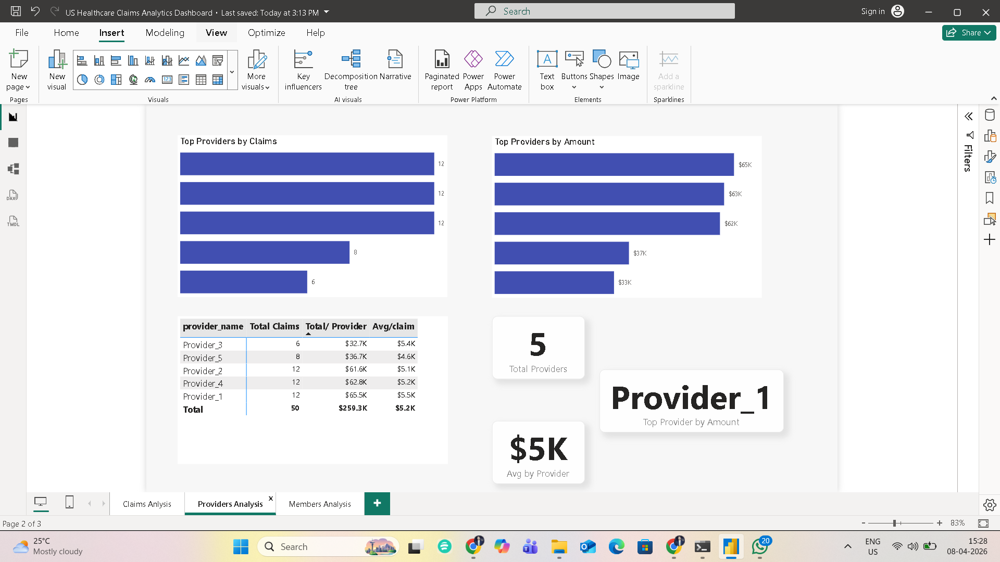

# Healthcare Claims Analysis

## Overview
This notebook presents SQL-based analysis on healthcare claims data, focusing on provider performance, member activity, and claim trends.The goal is to explore claim data and extract useful insights related to providers and members.

## Tools Used
- SQL (SQLite)
- Python (Pandas, Jupyter Notebook)

## Dataset
The analysis is based on healthcare-related tables:
- Members
- Providers
- Claims

## Key Analysis
- Total claims and total claim amount
- Provider-wise performance analysis
- Member-wise claim activity
- Claim status analysis (Approved / Pending)
- High-value claims identification
- Latest claim per member
- Window functions (ROW_NUMBER, RANK, running totals)
- Claim aging analysis

## Business Insights
- A small number of providers contribute to a large share of total claim amount
- Certain members show repeated claim activity, indicating higher healthcare utilization
- High-value claims may require additional validation or review
- Claim status distribution highlights approval and pending trends
- Claim patterns help identify potential anomalies or risk areas

## Why This Work Matters
This analysis demonstrates the application of SQL in a healthcare context, combining domain understanding with data analysis skills. It reflects real-world reporting scenarios relevant for Healthcare Data Analyst roles.

## Dashboard Preview

### Claims Analysis

### Providers Analysis

### Members Analysis

## Insights from Dashboard
- Claims showed a declining trend from January to March
- Denial rate provides quick insight into claim rejection patterns
- Distribution chart highlights proportion of Approved, Pending, and Denied claims
- Interactive filtering enables detailed member-level and provider-level analysis

## Tools Used
- Power BI
- DAX
- Data Modeling

## Author
Nitin Gupta  
Healthcare Domain | SQL | Python | Aspiring Data Analyst
